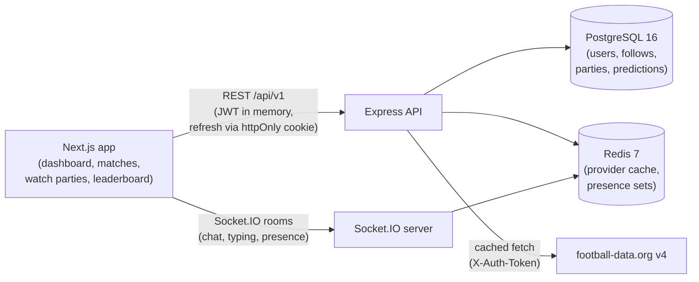

# Onside

A full-stack football fan platform — live match data, score predictions with scoring, watch parties with real-time chat, follows, and a global leaderboard. Built as an npm-workspaces monorepo with a Next.js frontend and an Express + Prisma API.

## Overview

Onside lets football fans follow the game together. The app pulls live competitions, standings, matches, and results from the [football-data.org](https://www.football-data.org) API (cached in Redis to respect its rate limits), and layers community features on top: users register and log in with a JWT-based auth flow, follow other fans, favorite teams, predict match scores, and gather in per-match watch parties with real-time chat and presence. Predictions are scored automatically once a match finishes and feed a global leaderboard.

## Features

- **Authentication** — register/login/logout with bcrypt-hashed passwords, 15-minute JWT access tokens held in memory, and 30-day refresh tokens in httpOnly cookies with revocation on logout; silent refresh on page load
- **Live football data** — competitions, standings, matches, and match details from football-data.org, cached in Redis (30–60s TTLs) with rate-limit handling
- **Score predictions** — predict home/away scores per match; automatic evaluation when a match finishes (3 points for an exact score, 1 point for a correct winner), evaluated idempotently
- **Watch parties** — create or join a room per match (public or private, invite codes), with real-time chat, typing indicators, and Redis-backed presence counts over Socket.IO
- **Social** — follow/unfollow other users by username and check follow status; favorite teams
- **Global leaderboard** — top 20 users ranked by accumulated prediction points
- **Protected routes** — API middleware guards every authenticated endpoint; the dashboard, profile, and watch-party pages require a session

## Tech Stack

- **Frontend:** Next.js 14 (App Router), React 18, Tailwind CSS 3, socket.io-client
- **Backend:** Node.js, Express 4, Socket.IO 4, Prisma ORM 5
- **Database:** PostgreSQL 16
- **Cache / presence:** Redis 7
- **External API:** football-data.org v4
- **Tooling:** Docker Compose (local Postgres + Redis), npm workspaces

## Architecture

A single Express process serves the REST API and the Socket.IO server. The web app talks to the API over REST and holds its access token in memory (silent refresh via the httpOnly cookie). Real-time chat and presence run over Socket.IO rooms; presence counts are kept in Redis. Provider responses are cached in Redis so repeated views don't hit the football-data.org rate limit.



## Project Structure

```
onside/
├── package.json                # npm workspaces + dev scripts
├── docker-compose.yml          # local PostgreSQL 16 + Redis 7
├── apps/
│   ├── api/                    # Express + Socket.IO + Prisma
│   │   ├── prisma/             # schema (6 models) + migrations
│   │   ├── .env.example
│   │   └── src/
│   │       ├── server.js       # Express app + HTTP server bootstrap
│   │       ├── config/env.js   # env vars, fail-fast validation
│   │       ├── db/             # Prisma and Redis clients
│   │       ├── lib/            # tokens, password hashing, refresh store
│   │       ├── middleware/     # requireAuth
│   │       ├── integrations/
│   │       │   └── football-provider/   # football-data.org client + Redis cache
│   │       ├── modules/        # auth, users, competitions, teams, matches,
│   │       │                   # favorites, follows, watch-parties,
│   │       │                   # predictions (+ scoring), leaderboards
│   │       └── websocket/      # Socket.IO: auth handshake, rooms, chat, presence
│   └── web/                    # Next.js 14 App Router frontend
│       ├── app/                # /dashboard /matches /matches/[id] /teams/[id]
│       │                       # /leaderboard /profile /u/[username]
│       │                       # /watch-party/[id] /login /register
│       ├── components/         # MatchChat, Roomchat, PredictionWidget, Logo
│       └── lib/                # API client (silent refresh), socket client
└── packages/shared/            # shared workspace package
```

## Getting Started

Prerequisites: Node.js 18+, Docker (for PostgreSQL and Redis), and a [football-data.org](https://www.football-data.org/register) API key (free tier available).

```bash
npm install                 # installs all workspaces
docker compose up -d        # starts Postgres and Redis
cp apps/api/.env.example apps/api/.env
# edit apps/api/.env — set FOOTBALL_DATA_API_KEY to your key
npm run prisma:migrate      # creates the schema (asks for a migration name)
npm run dev:api             # terminal 1 — API on http://localhost:4000
npm run dev:web             # terminal 2 — web app on http://localhost:3000
```

## Environment Variables

All API configuration lives in `apps/api/.env` (see `.env.example` for placeholders). The API validates required variables at startup and exits fast if one is missing.

| Variable | Required | Description |
| --- | --- | --- |
| `PORT` | No | API port (default `4000`) |
| `DATABASE_URL` | Yes | PostgreSQL connection string (defaults match docker-compose) |
| `REDIS_URL` | Yes | Redis connection string (defaults match docker-compose) |
| `JWT_ACCESS_SECRET` | Yes | Secret for signing 15-minute access tokens |
| `JWT_REFRESH_SECRET` | Yes | Secret for signing 30-day refresh tokens — keep different from the access secret |
| `WEB_ORIGIN` | No | Allowed CORS/WebSocket origin (default `http://localhost:3000`) |
| `FOOTBALL_DATA_API_KEY` | Yes | Key from football-data.org |
| `FOOTBALL_DATA_BASE_URL` | No | Provider base URL (default `https://api.football-data.org/v4`) |

## API Overview

All endpoints are mounted under `/api/v1`. Authenticated routes require `Authorization: Bearer <accessToken>`.

| Module | Endpoints |
| --- | --- |
| Auth | `POST /auth/register`, `POST /auth/login`, `POST /auth/refresh`, `POST /auth/logout` |
| Users | `GET /users/me` |
| Competitions | `GET /competitions`, `GET /competitions/:code/standings`, `GET /competitions/:code/matches` |
| Teams | `GET /teams/:id` |
| Matches | `GET /matches`, `GET /matches/:id` |
| Favorites | `GET /favorites/teams`, `POST /favorites/teams`, `DELETE /favorites/teams/:teamId` |
| Follows | `GET /follows/u/:username`, `POST /follows/:username`, `DELETE /follows/:username`, `GET /follows/:username/is-following` |
| Watch parties | `GET /watch-parties/match/:matchId`, `POST /watch-parties`, `GET /watch-parties/:id`, `POST /watch-parties/:id/join`, `POST /watch-parties/:id/leave` |
| Predictions | `POST /predictions`, `GET /predictions/me`, `GET /predictions/match/:matchId` |
| Leaderboards | `GET /leaderboards/global` |

Example — register and read the current user:

```bash
curl -X POST http://localhost:4000/api/v1/auth/register \
  -H "Content-Type: application/json" \
  -d '{"email":"test@example.com","username":"testuser","password":"password123"}'

curl http://localhost:4000/api/v1/users/me \
  -H "Authorization: Bearer <accessToken>"
```

## Usage

1. Create an account at `http://localhost:3000/register` — you stay logged in across page reloads via silent refresh.
2. Browse live matches and competition standings on the dashboard.
3. Open a match, predict the final score, and (once the match finishes) see your points awarded — 3 for an exact score, 1 for the correct winner.
4. Join or create a watch party for a match and chat in real time while it's live.
5. Follow other fans from their profile page and check your rank on the global leaderboard.

## Future Improvements

- Make the web client's API/Socket.IO URLs configurable via environment variables (currently hardcoded to localhost)
- Align the root workspace's Prisma version with `apps/api` (root declares 7.x, the API uses 5.x)
- Add automated tests and CI for the prediction-scoring and auth flows
- Persist watch-party chat history (currently in-memory over Socket.IO)
- Deploy the API and web app, and move the database/cache to managed services

## License

Licensed under the [Apache License 2.0](LICENSE).
